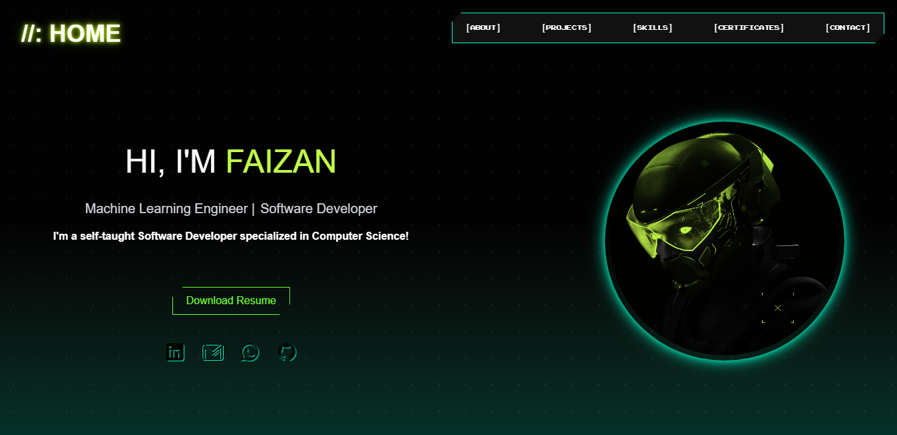

# Cyberpunk Portfolio Website

A futuristic, cyberpunk-inspired personal portfolio built with **React** and **Tailwind CSS**. This website showcases my expertise in **AI, Machine Learning, and Software Engineering**, featuring a neon-glow aesthetic, glitch effects, and a seamless scrolling experience.

## 🌐 Live Demo

🔗 [View Website](https://faizan9cm.vercel.app)

## 🎨 Features

- **Cyberpunk-Inspired UI** - Neon green, cyan, & glitch effects for a futuristic feel
- **Parallax & Scroll Animations** - Immersive scrolling experience
- **Glitchy Intro & Hover Effects** - Sci-fi-inspired interactions
- **Responsive Design:** Fully optimized for mobile, tablet, and desktop.
- **Dynamic Content Sections** - Smooth transitions between sections
- **AI & ML Showcase:** Projects and skills focused on AI, ML, and software engineering.

## 🛠 Tech Stack

- **Frontend:** React, Tailwind CSS, Framer Motion
- **Styling:** Custom Cyberpunk UI, Neon Effects, Grid Animations
- **Animations:** Framer Motion, CSS Transitions, Parallax Scrolling
- **Deployment:** Vercel

## 📂 Project Structure

```
├── src
│   ├── assets         # Images, icons, and static files
│   ├── components     # Reusable React components
│   ├── utils          # Utility functions, constants, and data
│   ├── main.jsx       # Entry point of the React application
│   ├── App.jsx        # Main component containing logic
│   ├── index.css      # Styles the app globally
├── public             # Static assets
├── package.json       # Dependencies and scripts
└── README.md          # This file
```

## 📸 Screenshots



## 📬 Contact

Feel free to connect with me for collaborations, AI, Data Science, or Software Engineering projects.

- 🔗 LinkedIn: [linkedin.com/in/faizan9cm](https://linkedin.com/in/faizan9cm)
- 🐙 GitHub: [github.com/faizan9cm](https://github.com/faizan9cm)
- 📧 Email: faizan9cm@gmail.com

---

### ⭐ If you like this project, don't forget to give it a star!
